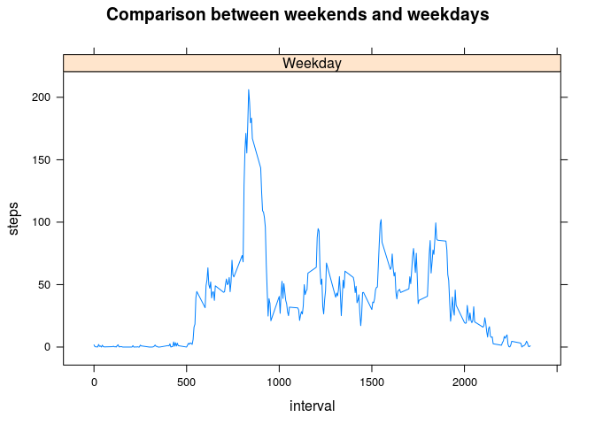

# Reproducible Research: Peer Assessment 1
I start by assuming that the file is already unzipped, and present in the current working directory, along side `PA1_template.Rmd`, even though I could simply add the `unzip("activity.zip")` function.

## Loading and preprocessing the data
- Load the raw data

```r
activity <- read.csv("activity.csv")
```
- Process/transform the raw data into a format suitable for the analysis. Later I need the locale to be "English" for dates, so I set it right now.


```r
Sys.setlocale("LC_TIME", "English")
```

```
## Warning in Sys.setlocale("LC_TIME", "English"): OS reports request to set
## locale to "English" cannot be honored
```

```
## [1] ""
```

```r
activity$date <- as.Date(activity$date)  
```
## What is mean total number of steps taken per day?
- Ignoring the missing values with `na.rm=T` producing the `total_steps` variable

- Using the `hist` function, producing an histogram, showing the number of steps taken each day

- Calculate the mean and median  


```r
total_steps <- aggregate(steps ~ date, data=activity, sum, na.rm=T)
hist(total_steps$steps, xlab="Number of steps per day", main="Histogram of total steps taken per day")
```

 

```r
mean_steps <- mean(total_steps$steps)
median_steps <- median(total_steps$steps)
```

The resulting mean for the steps is 1.0766189\times 10^{4}, whereas the median is  10765.

## What is the average daily activity pattern?
- Time series plot of the 5-minute interval (x-axis) and the average number of steps taken, averaged across all days (y-axis)


```r
steps_interval <- aggregate(steps ~ interval, data = activity, mean, na.rm = T)
max_steps_interval <- steps_interval[which.max(steps_interval$steps), ]$interval
plot(steps ~ interval, data = steps_interval, type = "l")
abline(v=max_steps_interval, col="blue")
```

 


The blue line above marks the 835th interval, which reflects the maximum number of steps.

## Imputing missing values
- Calculating and reporting the number of missing values in the dataset

```r
missing_values <- sum(is.na(activity$steps))
```

The number of values missing in the `activity.csv` dataset is 2304 values.


- Strategy to fill the missing values in the dataset, as suggested, I simply add the mean for the interval
- To avoid corrupting the original data, and having to reload it completely, I create another variable called `filled`
- then the procedure is simply the same as the one for the previous histogram


```r
filled <- activity
for (i in 1:length(filled[,1])) {
  if (is.na(filled$steps[i])){
    filled$steps[i] <- steps_interval$steps[steps_interval$interval==filled$interval[i]]
  }
}

filled_steps <- aggregate(steps ~ date, data=filled,sum)
hist(filled_steps$steps, xlab="Number of steps per day", main="Histogram of total steps taken per day without missing values")
```

 

```r
filled_mean_steps <- mean(filled_steps$steps)
filled_median_steps <- median(filled_steps$steps)
```

For the filled set of data the mean is then 1.0766189\times 10^{4} steps per day, while the median value is 1.0766189\times 10^{4}


## Are there differences in activity patterns between weekdays and weekends?

- Using the filled data  
- Creating a new factor variable in the dataset, with two levels "weekday" and "weekend", indicatign whether a given date is a weekday or weekend day
- *Since I am using a system with English as locale, from this point onward it is assumed that the locale of the person running the code is the same*


```r
filled$day <- ifelse(filled$date %in% c("Saturday","Sunday"), "Weekend", "Weekday")
filled <- transform(filled, day=factor(day))
```

- Making a panel plot containing a time series plot, of the 5-minute interval and the average number of steps taken, averaged across all weekday days or weekend days. Since the examples are done using the `lattice` library, I use the same here.


```r
steps_intervals_by_day <- aggregate(steps ~ interval + day, data=filled, mean)
library(lattice)
xyplot(steps~interval|day, data=steps_intervals_by_day, type = "l", main="Comparison between weekends and weekdays")
```

 
